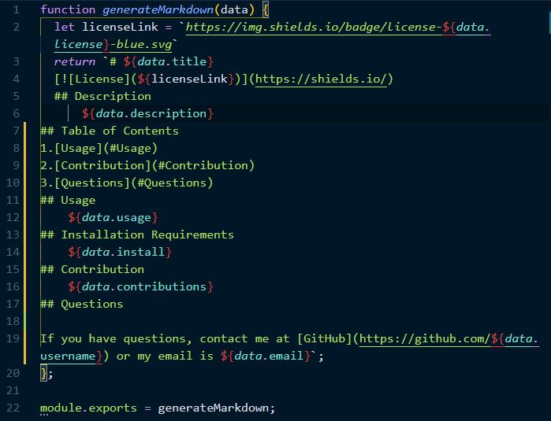
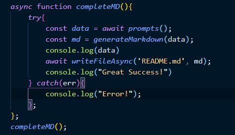

# ReadmeGenerator
  
  ## Description 
      This is a Javascript application designed to assist with creating a readme.md file.
## Table of Contents
1.[Usage](#Usage)
2.[Installation](#Installation)
3.[Contribution](#Contribution)
4.[Questions](#Questions)
## Usage
    This was designed to assist web developers write concice, well formatted 'readme' files for projects. By utilizing 'inquirer;, it allows for inputs directly into the command prompt, and takes the users inputs and generates a '.md' file will all pertinent project information.

    By utilizing 'Inquirer', the user is prompted for multiple inputs.The data inputted is then passed through a separate file, "generateMarkdown.js", that data is filled into a Template Literal to create a .md file with the user supplied info.

    In the index.js file, the questions are constructed, as well as the file writing after the "generateMarkdown.js".

## Installation
    This application requires npm package 'inquirer' to run.   
## **[Here](https://drive.google.com/file/d/1nOfS_OWojWKGzLjqVtz3ixR34Jz3j2P3/view) is a link to a video, showing the program in action**             
## Contribution 
    Please contact Ben de Garcia to assist with future iterations.
## Questions
  
If you have questions, contact me at [GitHub](https://github.com/bdegarcia) or my email is degarcia.ben@gmail.com